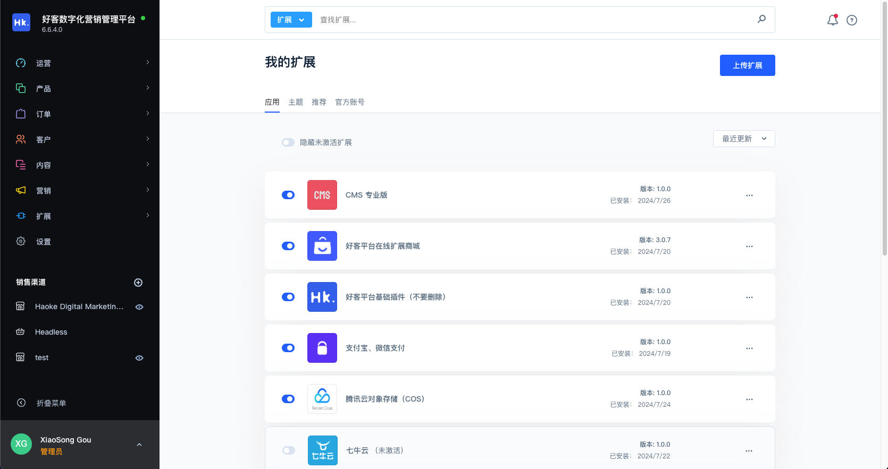
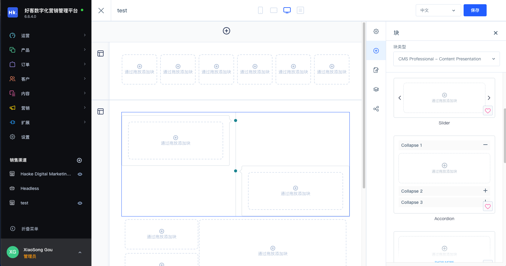
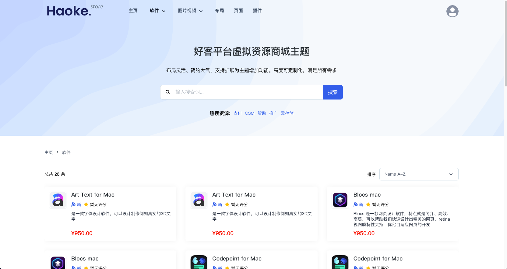

<p align="center">
    
</p>
<div align="center">

[](https://github.com/haokeyingxiao/haoke/actions/workflows/02-unit.yml)
[](https://gitee.com/zongzhige/shopxo/blob/master/LICENSE)
[](https://php.net/)
[](https://github.com/vuejs/vue)

[](https://github.com/haokeyingxiao/haoke/network)
[](https://github.com/haokeyingxiao/haoke/stargazers)

</div>

<h3 align="center">Haoke Digital Marketing System - Free and Open Source</h3>

<div align="center">

```shell
如果对您有帮助, 您可以点右上角 "Star" 收藏一下, 获取第一时间更新
```
</div>

## 🎉 功能特性

----------

- 💪 **最新技术栈**：使用php 8.2、Symfony 7 、Vue 3 、Vite 5、Pinia等前沿技术开发
- 📦 **插件与主题**：强大的插件系统，支持前后端分离插件式开发。在线一键安装、更新扩展和主题，可重写、修改系统全部已有功能
- 🌍 **国际化支持**：内置 i18n 支持，系统默认支持中文、英文、德语等，可通过插件商城在线安装语言包支持 50+ 国家语言
- 👏 **灵活的权限**：前后端分离权限管理。多管理员多角色管理、数据级别权限管理、并通过开发插件可实现更加细粒度的权限管理
- 🥳 **可视化设计**：内置可视化设计系统。在线可视化设计商城、CMS门户等页面。通过插件可以添加更多物料积木式搭建复杂美观的界面
- 🚀 **规则与流程**：内置规则构造器和流程构造器。通过自定义规则或流程，自动化、流水式执行业务。比如定义规则让每个客户购买价格不一样

## 🎨 系统预览

----------

### 我的插件



### 可视化设计



### 虚拟资源主题




## ⚙️ 安装

----------

#### 克隆正式版模版

```bash
git clone https://github.com/haokeyingxiao/production.git
```

#### 安装依赖

```bash
composer install
```

## 🙏 特别感谢

----------


📃 开源许可

----------

Haoke Digital Marketing System is completely free and released under the [MIT License](https://github.com/Haokeyingxiao/haoke/blob/trunk/LICENSE).
